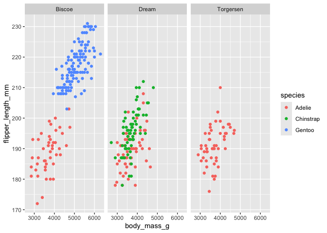

# Week 06 HW
SZR

<script src="Week_06_HW_files/libs/kePrint-0.0.1/kePrint.js"></script>
<link href="Week_06_HW_files/libs/lightable-0.0.1/lightable.css" rel="stylesheet" />

## Introduction

For this homework I am practicing working with *Quarto*.

This document shows:  
\* a figure of body mass by flipper length by island  
\* a table of average body mass and flipper length of only the Adelie
species

## Libraries

``` r
library(tidyverse)
library(here)
library(palmerpenguins)
library(kableExtra)
library(dplyr)
```

# Plotting

Plotting **body mass** by **flipper length** according to **species**
and faceted by **island**

``` r
penguins %>%
  ggplot(aes(x = body_mass_g, y = flipper_length_mm, color = species))+
  geom_point()+
  facet_grid(. ~ island)
```

<div id="fig-penguin-sp-isl">



Figure 1: This figure shows body mass by flipper length for each species
according to island

</div>

<a href="#fig-penguin-sp-isl" class="quarto-xref">Figure 1</a> shows a
positive relationship between **body mass** and **flipper length** among
all 3 species and islands. Chinstrap and Adelie appear to be a similar
size overall with Gentoo being much larger.

``` r
filtered_penguins <- filter(penguins, species == "Adelie")
         
filtered_penguins %>%
  group_by(island) %>%
  summarise(mean_mass = mean(body_mass_g, na.rm = TRUE),
            mean_flipper = mean(flipper_length_mm, na.rm = TRUE)) %>%
  kbl()  %>% ## this is a kable table
  kable_classic() %>% ## to make a kable theme
  kable_styling(full_width = FALSE)
```

<div id="tbl-penguin-adelie">

Table 1: Adelie by Island table

<div class="cell-output-display">

| island    | mean_mass | mean_flipper |
|:----------|----------:|-------------:|
| Biscoe    |  3709.659 |     188.7955 |
| Dream     |  3688.393 |     189.7321 |
| Torgersen |  3706.373 |     191.1961 |

</div>

</div>

<a href="#tbl-penguin-adelie" class="quarto-xref">Table 1</a> comparing
the **mean mass** and **mean flipper length** of only the **Adelie
penguins** sorted by island.
