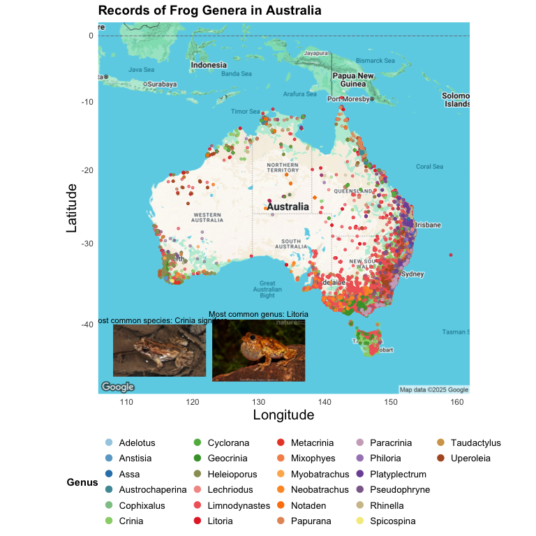

# Frogs of Australia Good Plot Bad Plot
SZR

``` r
library(here)
```

    here() starts at /Users/samantharickle/Desktop/R Stuff/Rickle

``` r
library(ggmap)
```

    Loading required package: ggplot2

    ℹ Google's Terms of Service: <https://mapsplatform.google.com>
      Stadia Maps' Terms of Service: <https://stadiamaps.com/terms-of-service>
      OpenStreetMap's Tile Usage Policy: <https://operations.osmfoundation.org/policies/tiles>
    ℹ Please cite ggmap if you use it! Use `citation("ggmap")` for details.

``` r
library(ggplot2)
library(tidyr)
library(RColorBrewer)
library(ggsci)
library(Polychrome)
library(randomcoloR)
library(dplyr)
```


    Attaching package: 'dplyr'

    The following objects are masked from 'package:stats':

        filter, lag

    The following objects are masked from 'package:base':

        intersect, setdiff, setequal, union

``` r
library(colorspace)
library(jpeg)
library(ggimage)
```


    Attaching package: 'ggimage'

    The following object is masked from 'package:ggmap':

        theme_nothing

``` r
tuesdata <- tidytuesdayR::tt_load('2025-09-02')
```

    ---- Compiling #TidyTuesday Information for 2025-09-02 ----
    --- There are 2 files available ---


    ── Downloading files ───────────────────────────────────────────────────────────

      1 of 2: "frogID_data.csv"
      2 of 2: "frog_names.csv"

``` r
frogs <- tuesdata$frogID_data
```

``` r
## Downloading data and cleaning

Australia <- get_map("Australia", zoom = 4, maptype = "terrain")
```

    ℹ <https://maps.googleapis.com/maps/api/staticmap?center=Australia&zoom=4&size=640x640&scale=2&maptype=terrain&language=en-EN&key=xxx-9nx81g>

    ℹ <https://maps.googleapis.com/maps/api/geocode/json?address=Australia&key=xxx-9nx81g>

``` r
frogs <- frogs %>%
  separate(col = scientificName, ## splitting full name into genus and species
           into = c("Genus", "Species"),
           sep = " ",
           remove = FALSE,
           extra = "merge")

frogs <- frogs %>%
  group_by(Species)%>%
  mutate(n_points_sp =n()) %>%
  group_by(Genus) %>%
  mutate(n_points = n()) %>% ## creating new column with count (n) of each genus
  arrange(n_points) %>% ## arrange in order of n
  mutate(Genus = factor(Genus, levels = unique(Genus)))


my_colors <- distinctColorPalette(26) ## creating 26 color custom palette
my_colors3 <- colorRampPalette(brewer.pal(12, "Paired"))(26) ## creating 26 color custom palette
my_colors4 <- qualitative_hcl(26, palette = "Set3")

c_signifera <- readJPEG(here("Week_08", "Images","C.signifera.jpeg"))
```

## Here is an example of a **BAD plot**

``` r
ggplot(data = frogs,
       aes(x = scientificName, y = n_points_sp)) +
  geom_bar(stat = "identity") +
  theme_minimal() +
  xlab("Forg type") +
  ylab("# of Froge") +
  ggtitle("FROGS") +
  theme(axis.text.x = element_text(angle = 45, hjust = 1))
```


### This is a bad plot because

- There are too many categories in x axis, making the species name
  overlap and impossible to read.
- Too much variation in y axis makes bars for uncommon species so small
  they disappear.
- Misspellings
- Overall boring
- No frog pictures D:


## Here is an example of a **GOOD plot**

``` r
ggmap(Australia) +
  geom_image(
    data = data.frame(x = 115, y = -43),
    aes(x = x, y = y, image = here("Week_08", "Images", "C.signifera.jpeg")),
    size = 0.25
  ) +
   geom_text(
    data = data.frame(x = 115, y = -43 + 3.5),  # slightly above the image
    aes(x = x, y = y),
    label = "Most common species: Crinia signifera",
    color = "black",
    size = 3
  ) +
  geom_image(
    data = data.frame(x = 130, y = -43),
    aes(x = x, y = y, image = here("Week_08", "Images", "L.peronii.jpg")),
    size = 0.25
  ) +
   geom_text(
    data = data.frame(x = 130, y = -43 + 4.25),  # slightly above the image
    aes(x = x, y = y),
    label = "Most common genus: Litoria",
    color = "black",
    size = 3
  ) +
  geom_point(
    data = frogs %>%
      arrange(desc(n_points)), ## plotting frog data in reverse n order (less frequent on top)
    aes(
      x = decimalLongitude,
      y = decimalLatitude,
      color = Genus ## color of points according to genus (too many species)
    ),
    alpha = 0.50, ## adjusting transparency
    size = 1 ## adjusting the size of the points
  ) +
  scale_color_manual(values = my_colors3) + ## using special brewer palette
 theme_minimal() +
  theme(
    legend.position = "bottom",
    legend.title = element_text(face = "bold"),
    legend.text = element_text(size = 10),
    legend.key.size = unit(0.4, "cm"),
    legend.box = "horizontal",
    axis.title.x = element_text(size = 15),
    axis.title.y = element_text(size = 15),
    plot.title = element_text(size = 14, face = "bold")
  ) +
  labs( ## adjusting labels
    x = "Longitude",
    y = "Latitude",
    title = "Records of Frog Genera in Australia"
  ) +
  guides(color = guide_legend(override.aes = list(size = 3, alpha = 1)))
```



### This is a good plot because

- The data is grouped by genus instead of species.
- Lat/long data of each frog is layered on top of the map of Australia.
- The colors correspond to each genus.
- Data is ordered to less common species are on top.
- Frog pictures :D


